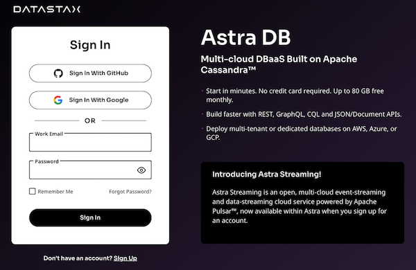
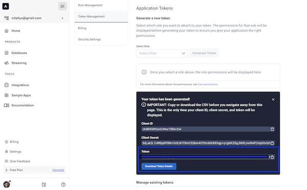

<!-- TOP -->

  
  

    Getting Started with Astra CLI
    ℹ️ For technical support, please contact us via <a href="mailto:cedrick.lunven@datastax.com">email</a> or <a href="https://dtsx.io/cedrick">LinkedIn</a>.
  

<!-- CONTENT -->
<main>
     
    

     

      

            
Scenario to get started with Astra CLI

            <table>
             <tr>
              <td>Difficulty:</td><td>🟢 Beginner</td>
             </tr>
             <tr>
              <td>Time:</td><td> ⏰ 15 minutes</td>
             </tr>
            </table>
      

     

    

### 1. Create an Astra Account

> **Datastax Astra** is a cloud-native, fully managed database-as-a-service (DBaaS) based on Apache Cassandra. It provides a scalable, performant and highly available database solution without the operational overhead of managing Cassandra clusters. Astra supports both SQL and NoSQL APIs, and includes features like backup and restore, monitoring and alerting, and access control. It enables developers to focus on application development while the database infrastructure is managed by Datastax.

**`✅ 1.a` - Access [https://astra.datastax.com](https://astra.datastax.com) and register with `Google`,`Github` or an email address.**

### 2. Create an Astra Token

**`✅ 2.a` - Locate `Settings` (#1) in the menu on the bottom-left, then `Token Management` (#2)**

**`✅ 2.b` - Select the role `Organization Administrator` before clicking `[Generate Token]`**

**`✅ 2.c` - Copy your token in the clipboard.**

<!-- NAVIGATION -->

 <a href='command:katapod.loadPage?[{"step":"step1"}]' 
   class="btn btn-primary btn-astra">
    I have my token, Let's start
 </a>

</main>
